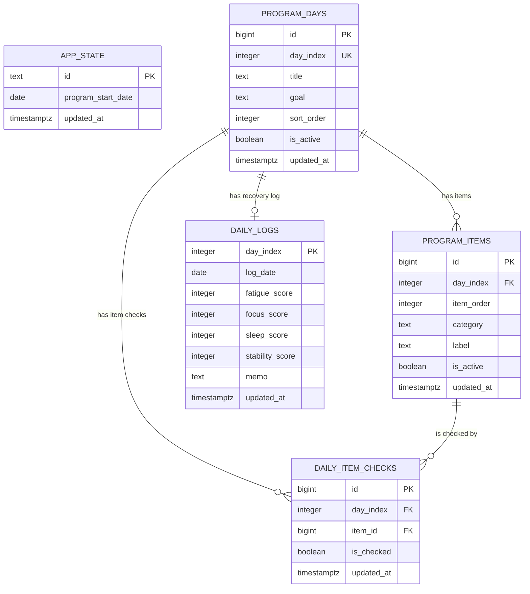

# Data Model

## 문서 목적

이 문서는 `health-checker`에서 사용할 Supabase 기반 데이터 모델을 정의한다.

목표는 다음과 같다.

- 운동 프로그램 정의와 사용자 기록의 경계를 명확히 한다.
- 체크리스트 항목을 프론트엔드 하드코딩이 아니라 DB에서 관리할 수 있게 한다.
- 일자별 노출 순서, 항목 카테고리, 체크 상태를 분리해 확장 가능하게 만든다.

## 현재 구현 상태

2026-05-17 현재 앱은 아래 구조로 동작한다.

- 7일 운동 프로그램 정의는 `app.js`의 `program` 배열에 정적으로 들어 있다.
- Supabase에는 `app_state`, `daily_logs`만 사용한다.
- 체크 상태는 `daily_logs.checked_items` JSON 안에 저장한다.

현재 방식은 빠르게 MVP를 만들기에는 좋지만, 체크리스트 문구 수정, 항목 추가/삭제, 순서 변경에는 약하다.

## 목표 설계

체크리스트를 DB화한 이후의 목표 구조는 다음과 같다.

- `program_days`: 1일차부터 7일차까지의 제목과 목표
- `program_items`: 각 일차에 노출할 체크리스트 항목
- `daily_item_checks`: 사용자가 각 항목을 체크했는지 여부
- `daily_logs`: 하루 단위 회복 기록
- `app_state`: 프로그램 시작일 같은 전역 상태

핵심 원칙:

- 항목 식별자는 `program_items.id`를 사용한다.
- `id`는 `bigint generated by default as identity`로 자동 증가시킨다.
- `item_order`는 식별자가 아니라 일자별 노출 순서로만 사용한다.
- `category`는 항목의 의미 분류 컬럼으로 둔다.
- 체크 상태는 `daily_item_checks.item_id`로 항목에 연결한다.

## 시각화



## 테이블 정의

### 1. app_state

목적:

- 현재 프로그램의 기준 시작일과 전역 상태를 저장한다.

필드:

- `id: text`
  - 단일 레코드 식별자
  - 초기값은 `default`
- `program_start_date: date`
  - 1일차로 계산할 기준 날짜
- `updated_at: timestamptz`

메모:

- MVP에서는 레코드 1개만 사용한다.
- 프로그램을 다시 시작하는 기능이 필요해지면 이 값을 갱신한다.

### 2. program_days

목적:

- 7일 프로그램의 일차별 제목과 목표를 저장한다.

필드:

- `id: bigint`
  - 자동 증가 primary key
- `day_index: integer`
  - 1부터 7까지의 일차
- `title: text`
  - 예: `회복 시작일`
- `goal: text`
  - 예: `몸을 다시 움직여도 괜찮다는 감각 만들기`
- `sort_order: integer`
  - 화면 노출 순서
- `is_active: boolean`
  - 비활성 일차 숨김 처리용
- `updated_at: timestamptz`

제약:

- `day_index`는 unique
- `day_index`는 1 이상 7 이하

### 3. program_items

목적:

- 각 일차에 표시할 체크리스트 항목을 저장한다.

필드:

- `id: bigint`
  - 자동 증가 primary key
  - 체크 상태 연결에 사용하는 안정적인 항목 식별자
- `day_index: integer`
  - 어떤 일차에 속하는지
- `item_order: integer`
  - 해당 일차 안에서의 노출 순서
- `category: text`
  - 항목 의미 분류
  - 예: `hydration`, `sunlight`, `mobility`, `walking`, `strength`, `nutrition`, `reflection`
- `label: text`
  - 화면에 표시할 체크리스트 문구
- `is_active: boolean`
  - 비활성 항목 숨김 처리용
- `updated_at: timestamptz`

제약:

- `id`는 primary key
- `(day_index, item_order)`는 unique

메모:

- `item_order`는 체크 상태 식별자로 쓰지 않는다.
- 중간에 항목이 추가되어 순서가 바뀌어도 기존 체크 상태가 깨지지 않도록 `daily_item_checks`는 `item_id`를 참조한다.

### 4. daily_item_checks

목적:

- 사용자가 각 체크리스트 항목을 완료했는지 저장한다.

필드:

- `id: bigint`
  - 자동 증가 primary key
- `day_index: integer`
  - 조회 편의를 위한 일차
- `item_id: bigint`
  - `program_items.id` 참조
- `is_checked: boolean`
  - 체크 여부
- `updated_at: timestamptz`

제약:

- `(day_index, item_id)`는 unique

메모:

- 체크 항목을 해제할 때 row를 삭제하지 않고 `is_checked = false`로 갱신한다.
- `day_index`는 중복 정보지만, 일차별 조회를 단순하게 만들기 위해 둔다.

### 5. daily_logs

목적:

- 각 일차의 회복 기록을 저장한다.

필드:

- `day_index: integer`
  - 1부터 7까지의 일차
- `log_date: date`
  - 해당 일차가 실제로 대응되는 날짜
- `fatigue_score: integer`
  - 피로감
- `focus_score: integer`
  - 집중력
- `sleep_score: integer`
  - 잠의 질
- `stability_score: integer`
  - 몸의 안정감
- `memo: text`
  - 자유 기록
- `updated_at: timestamptz`

제약:

- `day_index`는 primary key
- 점수 필드는 1 이상 5 이하

## 권장 SQL 초안

```sql
create table app_state (
  id text primary key,
  program_start_date date not null,
  updated_at timestamptz not null default now()
);

create table program_days (
  id bigint generated by default as identity primary key,
  day_index integer not null unique check (day_index between 1 and 7),
  title text not null,
  goal text not null,
  sort_order integer not null,
  is_active boolean not null default true,
  updated_at timestamptz not null default now()
);

create table program_items (
  id bigint generated by default as identity primary key,
  day_index integer not null references program_days(day_index),
  item_order integer not null,
  category text not null,
  label text not null,
  is_active boolean not null default true,
  updated_at timestamptz not null default now(),
  unique (day_index, item_order)
);

create table daily_logs (
  day_index integer primary key check (day_index between 1 and 7),
  log_date date not null,
  fatigue_score integer check (fatigue_score between 1 and 5),
  focus_score integer check (focus_score between 1 and 5),
  sleep_score integer check (sleep_score between 1 and 5),
  stability_score integer check (stability_score between 1 and 5),
  memo text not null default '',
  updated_at timestamptz not null default now()
);

create table daily_item_checks (
  id bigint generated by default as identity primary key,
  day_index integer not null references program_days(day_index),
  item_id bigint not null references program_items(id),
  is_checked boolean not null default false,
  updated_at timestamptz not null default now(),
  unique (day_index, item_id)
);
```

## 카테고리 초안

`category`는 별도 테이블로 분리하지 않고 `program_items.category`의 text 컬럼으로 시작한다.

권장 값:

- `hydration`
- `sunlight`
- `mobility`
- `walking`
- `strength`
- `nutrition`
- `reflection`
- `recovery`
- `daily_activity`

나중에 카테고리 표시명, 색상, 아이콘을 관리하고 싶어지면 `item_categories` 테이블로 분리한다.

## 조회 시나리오

### 앱 로딩

1. `app_state`에서 `program_start_date`를 조회한다.
2. `program_days`에서 active 일차 목록을 조회한다.
3. `program_items`에서 active 항목 목록을 조회한다.
4. `daily_logs`에서 회복 기록을 조회한다.
5. `daily_item_checks`에서 체크 상태를 조회한다.
6. 프론트엔드에서 `day_index`와 `item_id` 기준으로 합쳐 렌더링한다.

### 체크 항목 변경

1. 사용자가 특정 항목을 체크하거나 해제한다.
2. 앱은 해당 항목의 `program_items.id`를 기준으로 `daily_item_checks`를 upsert한다.
3. `is_checked`와 `updated_at`을 갱신한다.

### 회복 기록 변경

1. 사용자가 피로감, 집중력, 잠의 질, 몸의 안정감, 메모를 수정한다.
2. `회복 기록 저장` 버튼을 누른다.
3. 앱은 해당 `day_index`의 `daily_logs`를 upsert한다.

## 마이그레이션 메모

현재 운영 DB에는 `daily_logs.checked_items jsonb`가 존재한다.

다음 단계에서 DB화할 때 권장 순서:

1. `program_days`, `program_items`, `daily_item_checks` 테이블을 추가한다.
2. 기존 7일 프로그램 데이터를 `program_days`, `program_items`에 seed한다.
3. 앱을 `program` 하드코딩 대신 Supabase 조회 방식으로 변경한다.
4. 기존 `daily_logs.checked_items` 값을 `daily_item_checks`로 옮긴다.
5. 마이그레이션 검증 후 `daily_logs.checked_items` 컬럼 제거를 검토한다.

## 보안 메모

첫 버전은 퍼블릭 사용을 가정하므로 Supabase publishable key가 브라우저에 노출된다.

허용 가능한 초기 정책:

- 누구나 `app_state` 읽기/쓰기 가능
- 누구나 `program_days` 읽기 가능
- 누구나 `program_items` 읽기 가능
- 누구나 `daily_logs` 읽기/쓰기 가능
- 누구나 `daily_item_checks` 읽기/쓰기 가능

주의:

- URL과 Supabase 설정을 아는 사람은 데이터를 수정할 수 있다.
- 개인 건강 기록을 민감 정보로 다루고 싶어지는 시점에는 로그인과 RLS 정책을 다시 설계해야 한다.

